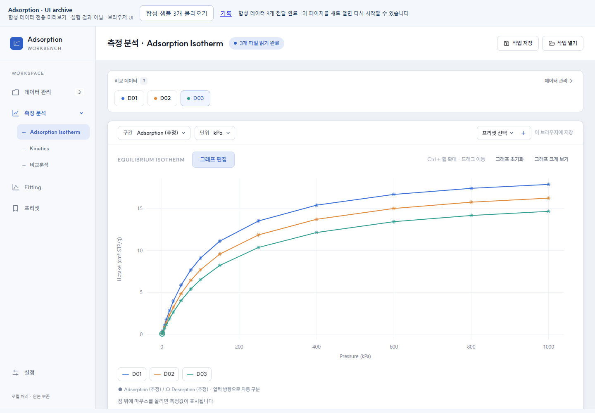
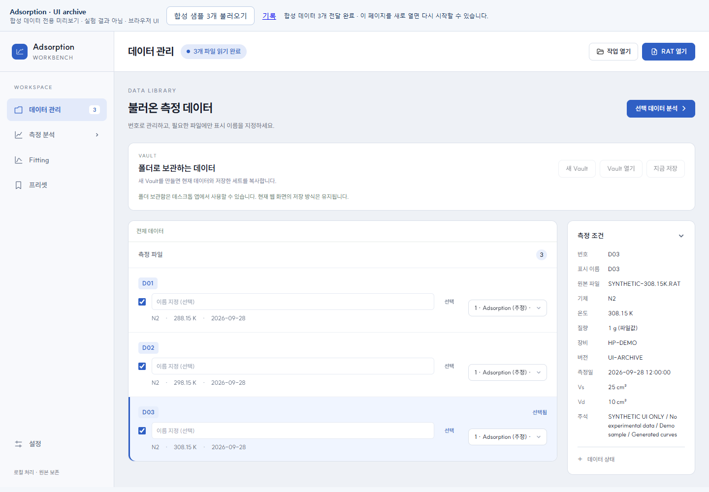
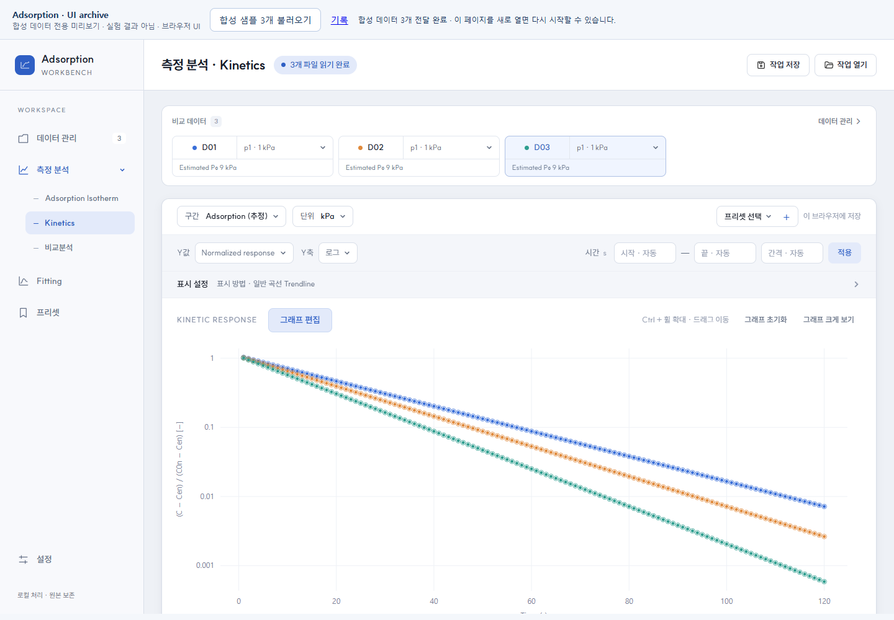
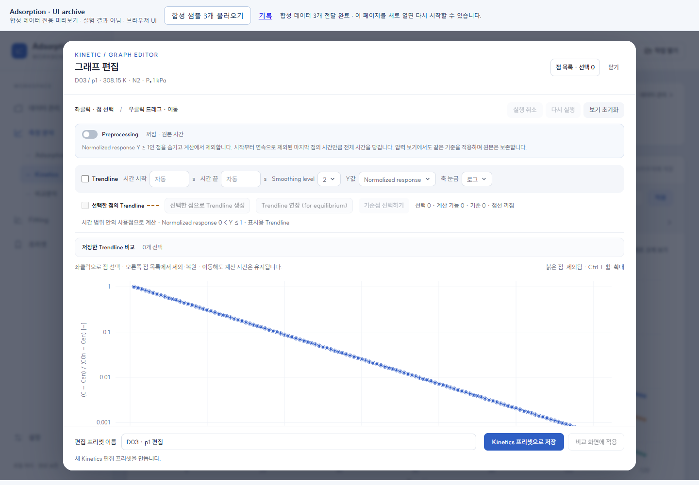
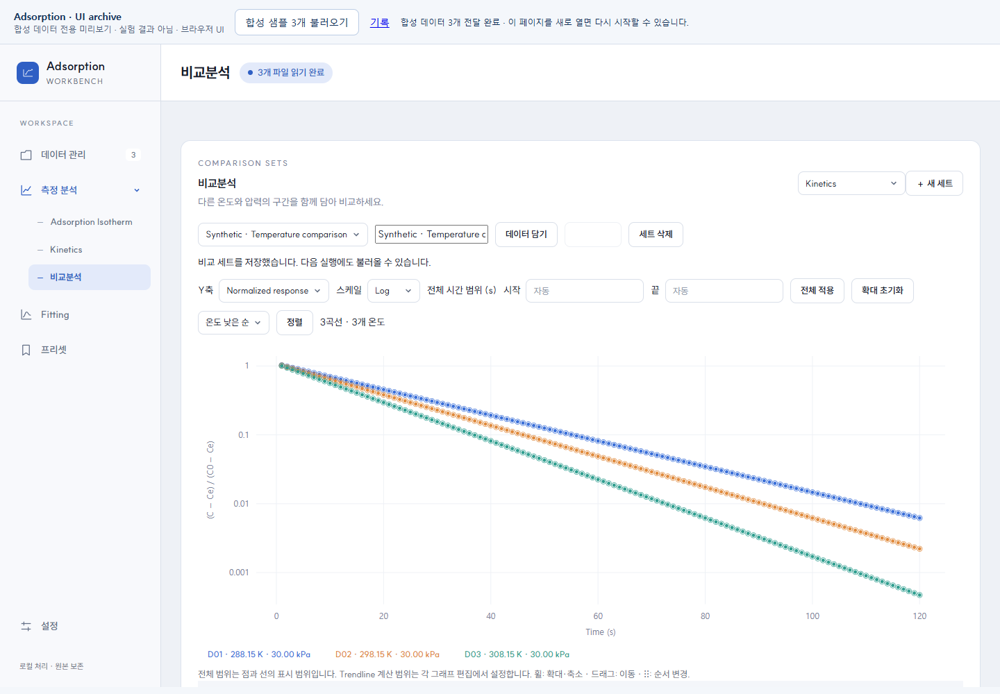
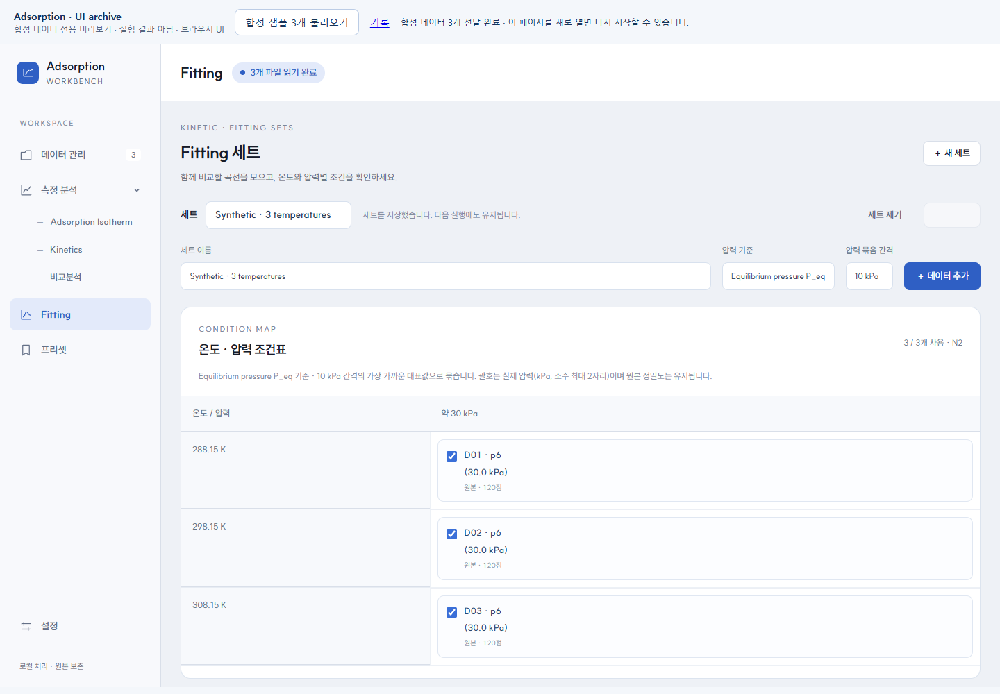
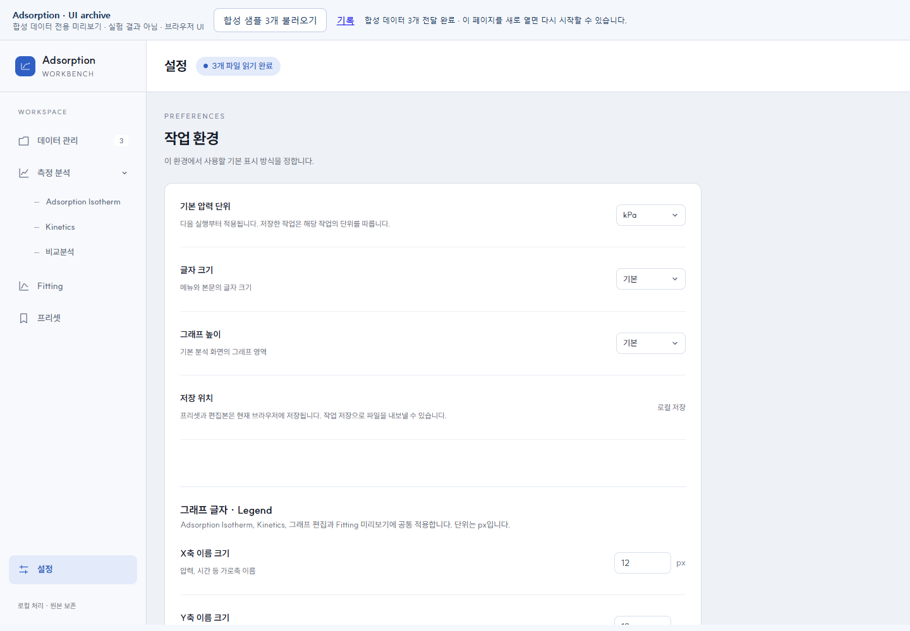

# Adsorption Workbench · Full UI

RAT 파일 관리부터 Isotherm·Kinetics 비교와 그래프 편집까지 이어지는 과학 데이터 분석 UI입니다.
**실제 V1 웹 UI를 캡처했습니다. 표시된 값은 모두 UI 확인용 합성 데이터이며 실험 결과가 아닙니다.**



## 보관 정보

| 항목 | 내용 |
| --- | --- |
| 프로그램 / 작성자 | Adsorption Workbench / sunghail |
| 원본 프로젝트 | [Adsorption_analysis_microtrac_RAT](https://github.com/sunghail/Adsorption_analysis_microtrac_RAT) |
| 기준 | 로컬 V1 · `v1-local-2026-09-28` |
| 유형 | Full Layout, Sidebar / Navigation, Data Visualization, Modal / Dialog, Table, Settings, Form / Input |
| 소스 범위 | 웹 UI·표시 계산·브라우저 저장 계층. native host / Python Fitting backend 미포함 |
| 상태 | draft: 화면 확인 완료, 독립 컴포넌트 패키지화는 하지 않음 |
| 원본 대조 | [source-manifest.json](source-manifest.json): 파일별 SHA-256과 로컬 V1 일치 여부 |
| capture | 2026-09-28 · Edge 154.0.4258.37 · 1440×1000 · DPR 1 · light |
| 데이터 | 288.15 / 298.15 / 308.15 K, 15구간 × 120개 시간점 × 3파일을 수식으로 생성 |

원본 프로그램의 과학적 정확성, 장비 응답, 실험 온도 경향을 검증하는 자료가 아닙니다.
캡처 상단의 합성 데이터 안내는 아카이브 preview 전용이며 V1 본 앱에 추가하지 않았습니다.

## 실제 화면

| 데이터 관리 | Kinetics |
| --- | --- |
|  |  |

| 그래프 편집 | 비교분석 |
| --- | --- |
|  |  |

| Fitting 조건표 | 설정 |
| --- | --- |
|  |  |

## 주요 기능 · 설계 의도

- **데이터 관리:** D01 형식의 번호와 사용자 이름으로 파일을 식별하고 비교 대상 선택.
- **Navigation:** 데이터 관리, 측정 분석의 하위 메뉴, Fitting, 프리셋, 설정 분리.
- **Isotherm / Kinetics:** 단위·축 설정, legend, 확대·이동, 선/점 표현을 목적에 맞게 사용.
- **그래프 편집:** 점 선택·제외/복원, 시간 범위, Preprocessing, Trendline 비교와 프리셋.
- **비교분석:** 온도·압력별 구간을 세트에 담고 정렬·색상·곡선별 편집을 관리.
- **Fitting 입력:** 선택 데이터의 온도 × 압력 조건표, 사용 여부와 초기 구간 설정.
- **설정:** 글자·그래프 크기, 축 제목·legend 표시를 조절.
- 원본 데이터와 편집 상태를 분리하고, 긴 파일 이름은 분석 화면의 주의를 분산하지 않도록 짧게 표시.

## Framework / library

| 역할 | 기술 |
| --- | --- |
| 앱 shell·UI 상태·폼 | Vanilla JavaScript ES modules / HTML / CSS |
| 그래프 컴포넌트 | Bklit chart source, React / React DOM 19.2.0 |
| 그래프 도구 | @visx/curve,event,scale,shape 4.0.1-alpha.0 / d3-shape 3.2.0 |
| 모션 | motion 12.27.0 |
| 번들 | esbuild 0.25.12 |
| 글꼴·아이콘 | SUIT Variable / Tabler Icons |
| 브라우저 저장 | IndexedDB / localStorage |
| 원본 데스크톱 host | pywebview 6.2.1, Windows WebView2 — 이 보관본에는 미포함 |

[package.json](source/package.json) · [package-lock.json](source/package-lock.json) · [외부 권리 기록](licenses/README.md)

shadcn/ui·Tabler는 기존 디자인 참고 이력이며 앱 shell의 CSS/runtime을 가져온 것은 아닙니다.
과거 검토했던 Anime.js를 현재 실행 의존성으로 표기하지 않습니다.

## 실행 방법

저장소 루트에서 다음을 실행합니다. Python 3.10 이상 권장입니다.

```sh
python -m http.server 8879 --bind 127.0.0.1
```

브라우저에서 아래 주소를 열고 **합성 샘플 3개 불러오기**를 누릅니다.

```text
http://127.0.0.1:8879/my-ui/adsorption-workbench/full-workbench/preview/
```

[preview/index.html](preview/index.html)은 실행 파일 위치 링크입니다. GitHub의 파일 보기 화면에서는 앱이 실행되지 않습니다.
`file://` 더블클릭 대신 HTTP로 여세요. 필요 데이터는 [sample-data.js](preview/sample-data.js)가 생성합니다.
이미 빌드된 JS·폰트·아이콘이 포함되어 있어 미리보기만 볼 때 npm 설치는 필요 없습니다.
사용자가 브라우저에서 저장한 세트는 해당 origin의 브라우저 저장소에만 남습니다.

**확인 순서:** 샘플 로드 → 데이터 관리 → 측정 분석/Isotherm → Kinetics/그래프 편집 → 비교분석에서 새 세트와 p6 세 구간 추가 → Fitting에서 같은 조건표 구성 → 설정.

### 소스 수정 후 재빌드

```sh
cd my-ui/adsorption-workbench/full-workbench/source
npm ci
npm run build
```

Node.js 20 이상을 권장합니다. 이 등록 과정에서는 기존 V1 번들을 보관했으며, 깨끗한 환경의 `npm ci` 재설치는 검사하지 않았습니다.
원본 package.json의 테스트 명령은 실측 fixture를 포함하지 않아 보관본에서 제거했습니다.

## 재사용할 코드

| 목적 | 시작 파일 | 연결되는 코드 |
| --- | --- | --- |
| Sidebar·페이지 전환·설정 | [workspace-shell.js](source/src/ui/workspace-shell.js) | [workspace.css](source/src/ui/workspace.css), 앱 DOM |
| 데이터 로딩·화면 연결 | [app.js](source/src/ui/app.js) | services / core / storage |
| 그래프·legend | [plot.js](source/src/ui/plot.js) | [graph-appearance.js](source/src/ui/graph-appearance.js), vendor charts |
| 그래프 편집 dialog | [curve-editor.js](source/src/ui/curve-editor.js) | core/kinetic-edit.js, core/edit-settings.js |
| 비교 세트·순서·색상 | [comparison-sets.js](source/src/ui/comparison-sets.js) | core/comparison-sets.js, storage/preset-store.js |
| Fitting 조건표 | [fitting-sets.js](source/src/ui/fitting-sets.js) | core/fitting-sets.js, fitting-runner.js |
| 시간별 표 옵션 | [table-options.js](source/src/ui/table-options.js) | core/table-columns.js |

파일은 앱의 DOM·데이터 형식에 연결되어 있습니다. 하나를 복사하는 것만으로 독립 컴포넌트가 되는 구조는 아닙니다.
다른 프로그램에 재사용할 때는 측정 데이터 모델, CSS selector, 저장소·API 의존성을 분리해야 합니다.

## 확인한 범위와 제한

- 보관한 번들에서 합성 RAT 3개 로드, Isotherm/Kinetics 표시, 그래프 편집 열기를 확인.
- 30 kPa의 세 온도 구간으로 비교 세트 생성·저장과 Fitting 조건표 생성·저장 확인.
- 7개 실제 화면을 캡처. 캡처 중 페이지 JavaScript 오류 0개.
- **Vault는 desktop bridge가 필요하여 이 웹 preview에서는 비활성화됩니다.**
- **Fitting 계산은 Python API가 필요하여 이 preview에서 실행할 수 없습니다.** 조건 세트와 UI 확인용입니다.
- 실행파일, 사용자 Vault/프로필, 실제 RAT, 논문, 피팅 결과는 포함하지 않습니다.
- 원본 repository의 특정 commit을 임의로 동일한 버전으로 지정하지 않았습니다. 로컬 snapshot은 manifest로 구분합니다.
- 모바일·모든 입력 오류·전체 계산 기능에 대한 검증은 이번 등록 범위에 포함하지 않습니다.

## 권리와 변경 이력

직접 작성한 UI 코드의 공개 재사용 라이선스는 아직 정하지 않았습니다.
외부 코드·폰트·아이콘의 기존 고지는 그대로 보관합니다. [권리 기록](licenses/README.md)을 확인하세요.

| 날짜 | revision | 변경 | 확인 |
| --- | --- | --- | --- |
| 2026-09-28 | v1-local-2026-09-28 | 웹 UI 보관본, 합성 preview, 화면 7개, 소스별 manifest 등록 | Edge 화면 흐름 확인 |
