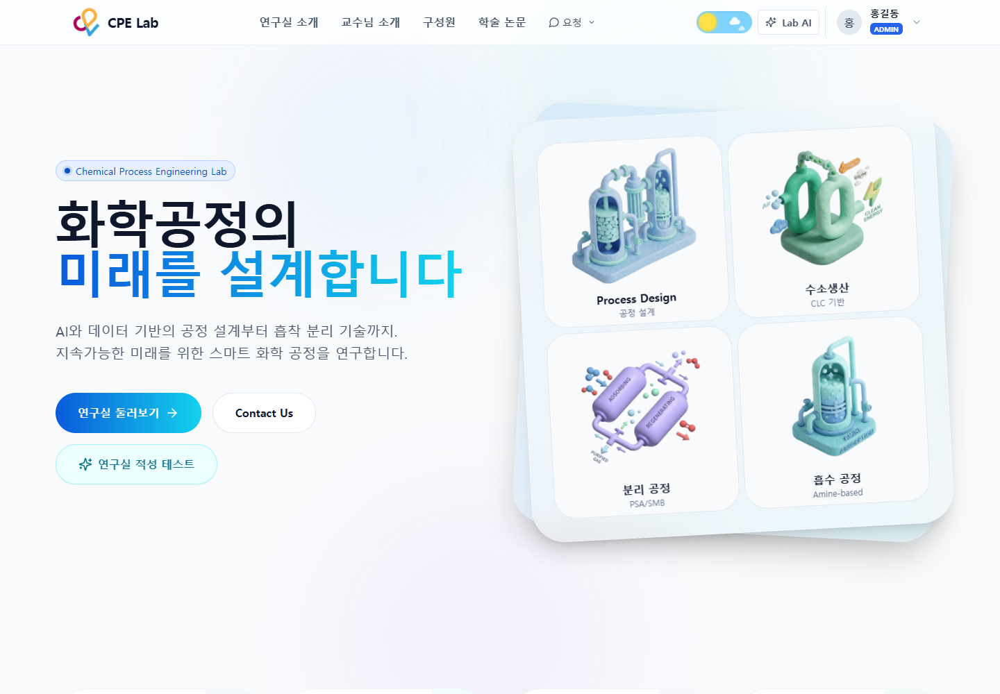

# LabWeb · 화학공정연구실 웹 플랫폼

연구실 소개(교수·구성원·논문)와 내부 업무(게시판·연구자료·랩미팅·협업공간·캘린더·자원관리)를 한 사이트에서 다루는 연구실 포털입니다.
이 아카이브는 **2026-09-30 기준 웹 UI**를 합성 데이터로 실행해 캡처한 기록과, 재사용할 만한 파일 브라우저 UI 소스를 보관합니다.

- 프로그램 slug: `labweb`
- 원본 repository: [sunghail/labweb](https://github.com/sunghail/labweb) (비공개)
- 기준 commit: `2c2b558` (2026-09-30)
- 실행 환경: web — Next.js App Router 서버 + PostgreSQL + 로그인 세션 필요
- 공통 기술: Next.js 16.0.7, React 18.3.1, Tailwind CSS 3.4.18, lucide-react 0.460.0
- 공통 코드 위치: 없음. 보관 소스는 [Full Site](full-site/README.md)의 `source/`에 한 번만 둡니다.
- UI 목록: [프로그램별 색인](../../catalog/my-ui.md)

## 화면 구성

| UI | 역할 | 상태 |
| --- | --- | --- |
| [Full Site](full-site/README.md) | 소개 페이지, 게시판, 연구자료 파일 브라우저, 랩미팅, 협업공간 버전 비교, 캘린더, 다크 모드, 모바일 폭 | draft |

## 공통 디자인 규칙

- **색:** slate 계열 중립색 + blue→cyan 그라데이션 강조(주요 버튼·제목 강조어). 기본 강조는 `blue-600`, 폴더는 `amber-500`.
- **형태:** 둥근 카드(`rounded-2xl`~`3xl`)와 옅은 원형 배경 번짐. 사이트에는 모서리를 줄이는 `theme-sharp` 디자인 테마도 있으나 캡처는 기본 테마입니다.
- **글꼴:** 라틴 문자는 Inter(`next/font/google`), 한글은 시스템 글꼴. Tailwind 설정의 `--font-pretendard` 변수는 정의되어 있지 않아 실제로 적용되지 않습니다.
- **아이콘:** lucide-react.
- **테마:** 밝게/어둡게 전환(localStorage `theme`). 모든 화면이 `dark:` 스타일을 가집니다.
- **메뉴 모드:** 로그인한 멤버는 상단 토글로 소개 메뉴와 업무 메뉴를 바꿉니다(localStorage `navMode`).
- **반응형:** 좁은 화면에서 상단 메뉴는 햄버거 메뉴로, 파일 트리는 서랍(drawer)으로 바뀝니다.

## 이력

- 2026-09-30: 프로그램 등록. 합성 데이터 실제 화면 13장, 파일 브라우저 UI 소스 발췌, 캡처 재현 스크립트 보관.
