# LabWeb · Full Site

연구실 소개 페이지부터 게시판, 연구자료 파일 브라우저, 랩미팅, 협업공간 버전 비교, 캘린더까지 이어지는 연구실 포털 UI입니다.
**실제 LabWeb을 실행해 캡처했습니다. 화면의 사람·게시글·파일·일정은 모두 UI 확인용 합성 데이터이며 실제 연구실 자료가 아닙니다.**

## 보관 정보

| 항목 | 내용 |
| --- | --- |
| 프로그램 / 작성자 | LabWeb / sunghail |
| 원본 프로젝트 | [sunghail/labweb](https://github.com/sunghail/labweb) (비공개) |
| 기준 | commit `2c2b558b4337ee240d2133a9cdce898373898fed` (2026-09-30) |
| 유형 | Full Layout, Sidebar / Navigation, Table, 기타(file-browser) |
| 소스 범위 | 파일 브라우저 클라이언트 컴포넌트 4개 발췌. 서버 액션·API·DB·인증 미포함 |
| 상태 | draft: 화면 확인 완료, 소스는 발췌본이라 단독 실행 불가 |
| 원본 대조 | [source-manifest.json](source-manifest.json): 파일별 SHA-256과 원본 commit의 Git blob id |
| capture | 2026-09-30 · Chrome 153.0.8010.50 headless · 1440×1000 · DPR 1 · light (12번 dark, 13번 390×844) |
| 데이터 | 별도 미리보기 DB의 합성 데이터: 사용자 7명, 게시글 8, 일정 13, 랩미팅 4(자료 6), 연구자료 파티션 3(파일 14·폴더 3), 협업공간 1(자료 3·버전 4) |

사용자 이름은 `홍길동`·`김철수`·`이영희` 같은 예시 이름, 메일은 `example.test` 도메인입니다.
파일 목록의 파일은 목록 표시용 기록만 있고 실제 파일은 저장하지 않았습니다. 그래서 다운로드·파일 미리보기는 캡처하지 않았습니다.

## 실제 화면

| 메인 (소개 메뉴) | 메인 · 다크 모드 |
| --- | --- |
|  | 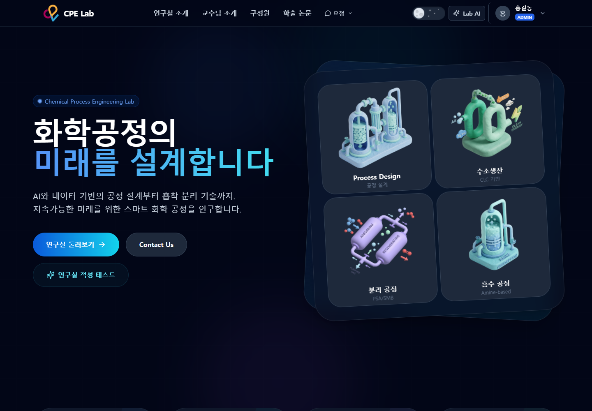 |

| 게시판 | 연구자료 |
| --- | --- |
| 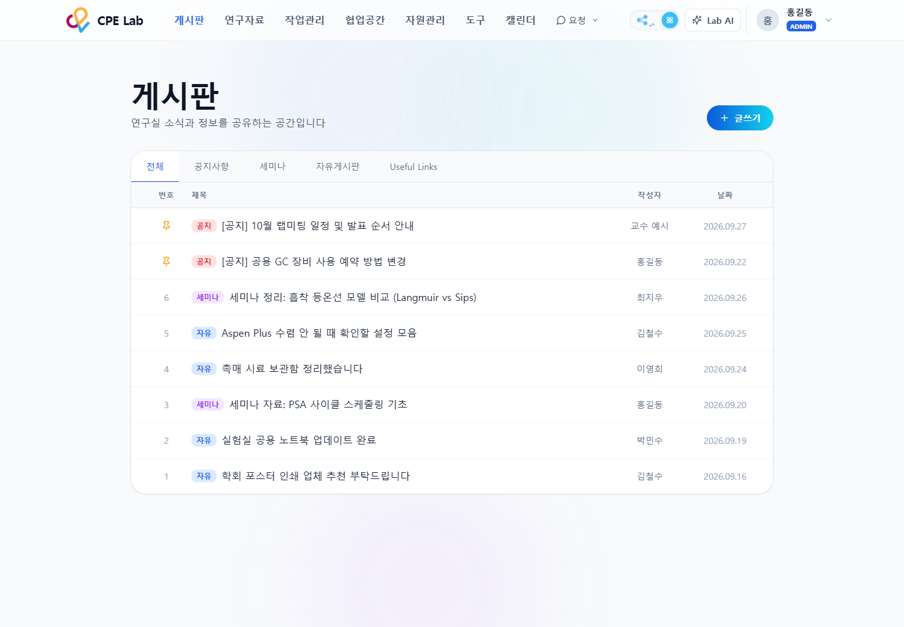 | 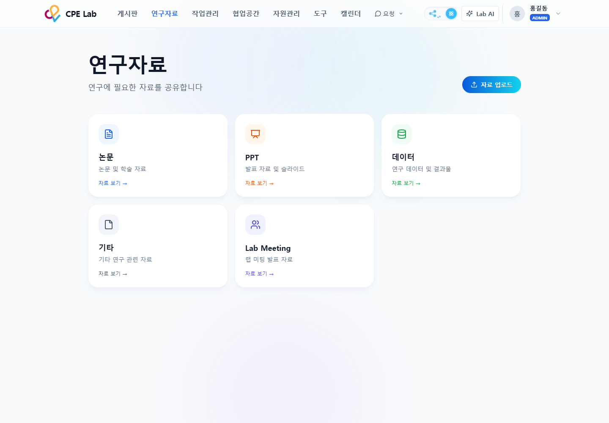 |

| 데이터 파티션 목록 | 파티션 파일 브라우저 (최상위) |
| --- | --- |
| 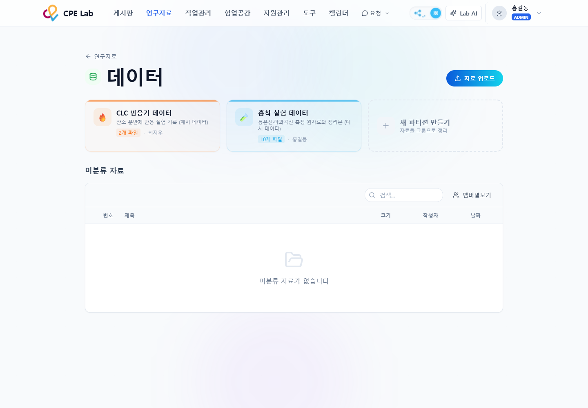 | 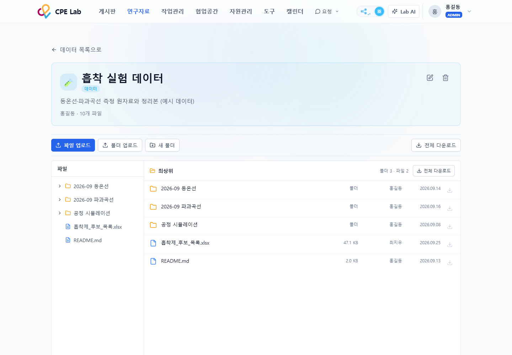 |

| 파일 브라우저 (폴더 안, 긴 파일명) | 랩미팅 (월별 목록) |
| --- | --- |
| 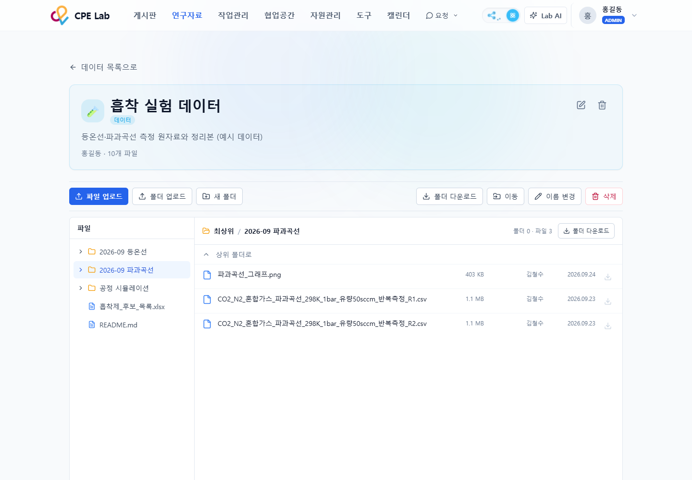 | 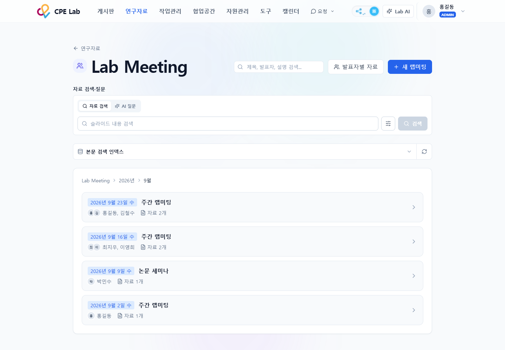 |

| 협업공간 | 협업공간 자료 · v1→v2 변경 비교 |
| --- | --- |
| 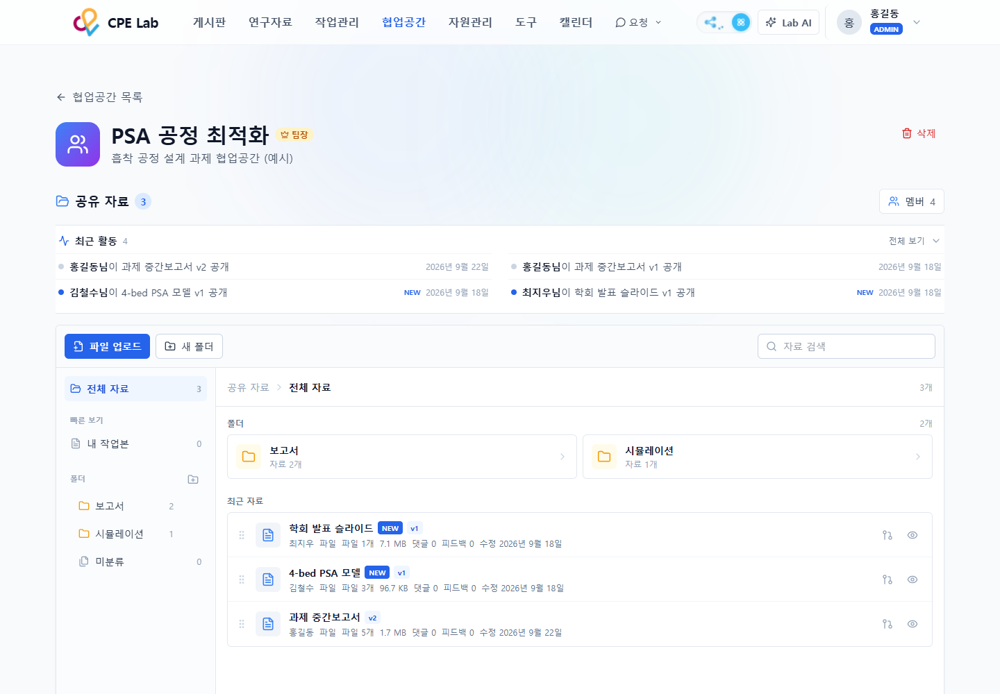 | 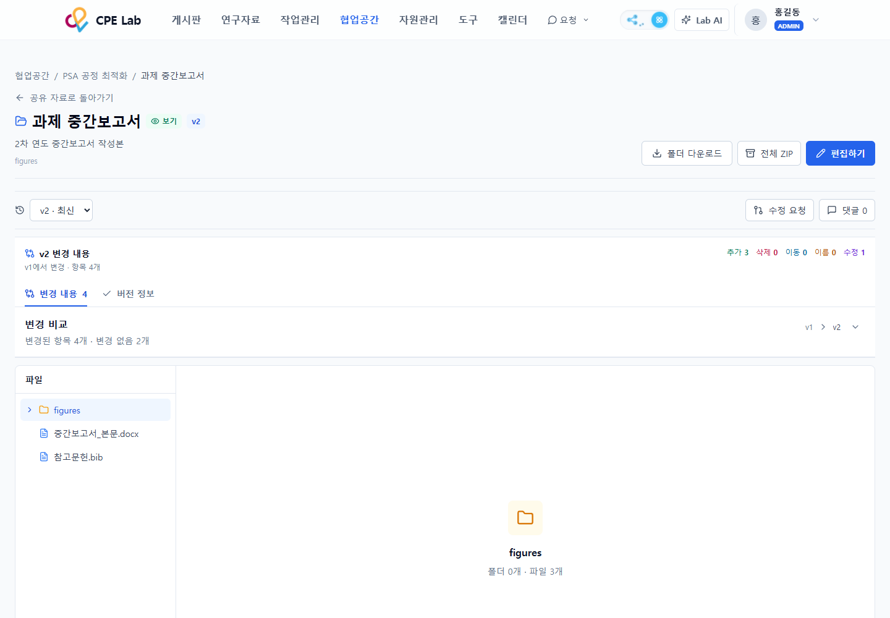 |

| 캘린더 | 모바일 폭 파일 브라우저 |
| --- | --- |
| 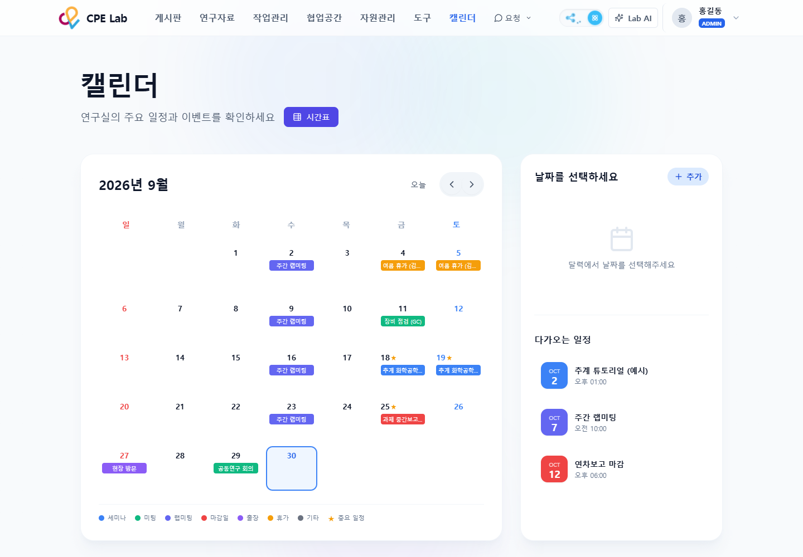 | 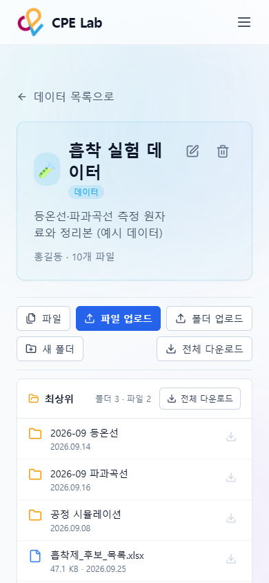 |

[구성원 (전체 페이지)](screenshots/02-members.png)

## 주요 기능 · 설계 의도

- **두 가지 메뉴:** 방문자에게는 소개 메뉴(연구실·교수·구성원·논문), 멤버에게는 토글로 업무 메뉴(게시판·연구자료·작업관리·협업공간·자원관리·도구·캘린더)를 보여 줍니다.
- **연구자료 파일 브라우저:** 왼쪽 트리 + 오른쪽 넓은 폴더 목록. 폴더를 누르면 미리보기 대신 탐색기처럼 이름·크기·올린 사람·날짜를 보여 주고, 긴 파일명은 자르지 않고 줄바꿈합니다. 행마다 작은 다운로드 버튼, 폴더는 ZIP으로 받습니다.
- **파일 이동:** 목록과 트리 양쪽에서 끌어다 놓기로 폴더를 옮기고, 끌기가 어려운 환경을 위해 "이동" 버튼의 폴더 선택 목록도 둡니다. 자기 자신·하위 폴더로의 이동과 제자리 이동은 받지 않습니다.
- **협업공간 버전:** 공유 자료를 v1, v2… 버전으로 발행하고 버전 사이 추가·삭제·이동·이름·수정 개수를 요약합니다.
- **랩미팅:** 연도 → 월 → 회차로 좁혀 들어가며 발표자와 자료 수를 보여 줍니다.
- **캘린더:** 분류별 색(세미나·미팅·랩미팅·마감·출장·휴가)과 다가오는 일정 목록.
- **반응형:** 390px 폭에서 메뉴는 햄버거, 파일 트리는 "파일" 버튼의 서랍, 목록의 크기·날짜는 이름 아래 한 줄로 접힙니다.

## Framework / library

| 역할 | 기술 |
| --- | --- |
| 앱 프레임워크 | Next.js 16.0.7 (App Router, 서버 컴포넌트 + 서버 액션) |
| UI | React 18.3.1 |
| 스타일 | Tailwind CSS 3.4.18 (`darkMode: 'class'`) |
| 아이콘 | lucide-react 0.460.0 |
| 글꼴 | Inter(`next/font/google`, 라틴) + 시스템 한글 글꼴 |
| 원본 앱의 서버 측 | PostgreSQL + Prisma 5, NextAuth 5 beta, Supabase Storage — 이 보관본에는 미포함 |

## 보관 소스 (발췌)

`source/`에는 원본 commit의 파일을 **바이트 그대로** 넣었습니다(원본이 CRLF). [.gitattributes](.gitattributes)가 줄바꿈 변환을 막습니다.

| 파일 | 역할 | 이 보관본에 없는 의존성 |
| --- | --- | --- |
| [FileTree.tsx](source/src/components/workspace/resource/FileTree.tsx) | 접히는 파일 트리. `onMoveEntry`를 넘기면 끌어서 폴더로 옮기기가 켜짐 | 없음 (`./types` 포함) |
| [types.ts](source/src/components/workspace/resource/types.ts) | 트리 항목 타입 `WorkspaceEntryView` 등 | 없음 |
| [FolderContents.tsx](source/src/components/materials/FolderContents.tsx) | 탐색기식 폴더 목록: breadcrumb, 상위 폴더, 행별 다운로드, 끌어서 이동 | `MaterialEntryView` 타입(`@/lib/material-partitions/entries`) |
| [PartitionBrowser.tsx](source/src/components/materials/PartitionBrowser.tsx) | 위 둘을 묶은 화면: 업로드·새 폴더·이동·이름 변경·삭제 도구줄, 모바일 서랍 | `FilePreview`, 서버 액션 `@/actions/material-partition-entry`, `uploadMaterialPartitionFiles`(`@/lib/chunked-upload`) |

**재사용하려면:** `FileTree`와 `FolderContents`는 React + Tailwind + lucide-react만 있으면 됩니다. `MaterialEntryView`는 `WorkspaceEntryView`에 `createdAt`, `uploaderId`, `uploaderName`을 더한 모양이므로 같은 필드를 가진 배열을 넘기면 됩니다. 이동은 `onMove(entryId, targetParentId | null)` 콜백으로 받아 직접 저장 로직에 연결합니다. 다운로드 링크는 `/api/materials/partitions/...` 경로로 고정되어 있어 다른 앱에서는 바꿔야 합니다.

## 캡처 재현

원본 앱을 운영 DB와 분리된 미리보기 DB로 실행하고 합성 데이터를 넣은 뒤 헤드리스 브라우저로 찍었습니다.
명령과 환경변수는 [preview/README.md](preview/README.md)에 있습니다. GitHub 파일 보기에서는 동작하는 데모가 없습니다(서버·DB·로그인이 필요한 앱).

캡처할 때만 다음을 바꿨고, 앱 코드는 수정하지 않았습니다.

- 개발 모드에만 나오는 Next.js 표시(N 배지)를 지웠습니다.
- 개발 서버의 `next/image`가 WebP 변환 요청에 응답하지 않아, 캡처 중 이미지 요청만 PNG로 받았습니다. 같은 원본을 같은 크기로 줄인 결과이며, 운영 서버에서 같은 이미지가 정상 표시되는 것을 확인했습니다.
- 메뉴 모드(소개/업무)와 테마를 localStorage 값으로 고정했습니다.

## 확인한 동작

- 2026-09-30: 13개 화면을 합성 데이터로 실행해 캡처. 페이지 오류 0건. 각 이미지를 열어 글자·레이아웃·잘림·개인정보 노출 여부를 확인.
- 2026-09-30: 390×844에서 메뉴·도구줄·목록이 접히는 반응형 배치 확인(13번).
- 2026-09-22: 격리한 미리보기 페이지에서 `FolderContents`·`FileTree`의 끌어서 이동 규칙을 합성 DragEvent로 확인 — 자기 하위 폴더로 이동 거부, 이미 들어 있는 폴더로 이동 무시, 다른 폴더·최상위로 이동 허용. 실제 마우스 끌기의 체감(시작 거리, 자동 스크롤)은 확인하지 않았습니다.

## 미확인 · 제약

- 파일 다운로드, 폴더 ZIP, 업로드, 파일 미리보기(PDF·Office), AI 기능, Google 캘린더 연동은 캡처 환경에서 실행하지 않았습니다.
- 캡처는 `next dev` 서버에서 했습니다. 운영 빌드 화면과 비교한 것은 메인 화면 이미지뿐입니다.
- 모바일 폭에서 긴 한글 제목이 단어 중간에서 줄바꿈됩니다(13번의 "흡착 실험 데 / 이터"). 실제 UI 동작 그대로입니다.
- 소스는 발췌본이라 이 폴더만으로는 실행되지 않습니다.

## 참고와 권리

- 참고한 UI: 없음 (Reference UI 항목 연결 없음)
- 직접 작성한 범위: 보관한 소스 4개 파일과 캡처 재현 스크립트
- 외부 코드·아이콘·글꼴: lucide-react(ISC), Inter(SIL OFL 1.1). 원본 파일은 복사하지 않았고 화면에 렌더링된 결과만 캡처에 있습니다.
- 캡처에 보이는 연구분야 일러스트 4종과 로고: 사이트 자산이며 제작 출처·라이선스를 확인하지 않았습니다. 재사용 가능으로 보지 않습니다.
- 내 코드의 라이선스: 미정(UNSPECIFIED). 공개 재사용을 허용한다는 뜻이 아닙니다.
- 상세: [권리 기록](licenses/README.md)

## 변경 이력

| 날짜 | revision | 변경 | 확인 |
| --- | --- | --- | --- |
| 2026-09-30 | labweb-2c2b558 | 최초 등록: 실제 화면 13장, 파일 브라우저 소스 발췌 4개, 캡처 재현 스크립트 | 화면 캡처·소스 해시 대조 완료, 기능 실행 일부 미확인 |
